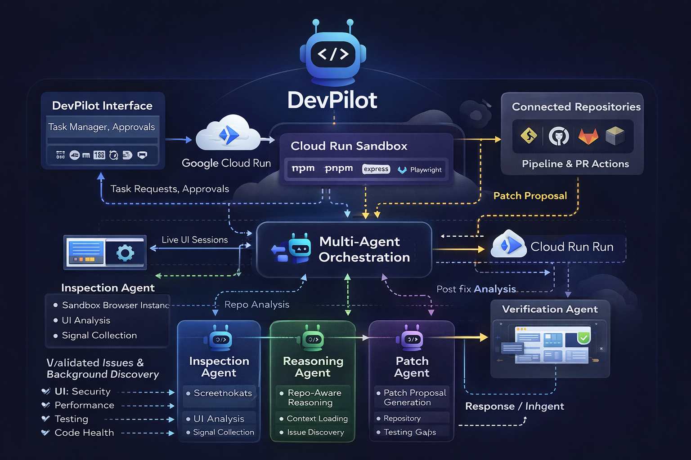
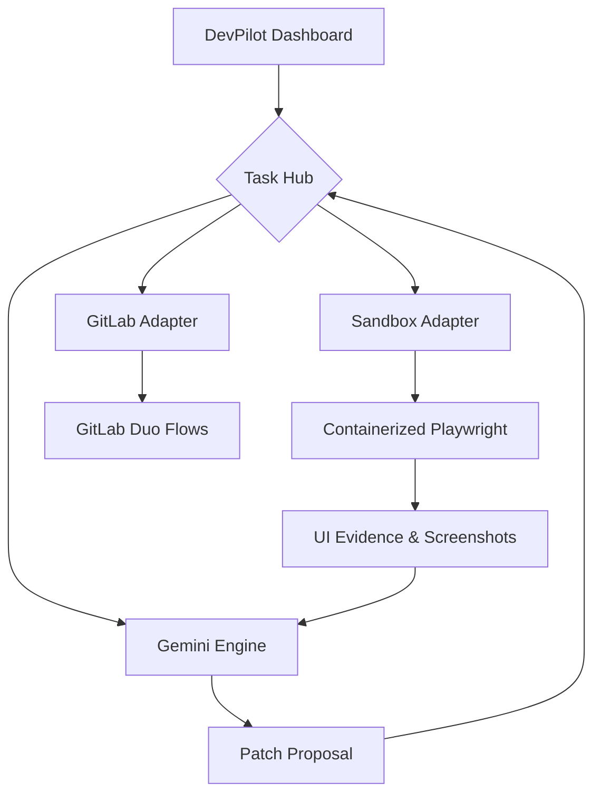

<div align="center">
  
  <h1>🚀 DevPilot: Enterprise-Grade AI Automation</h1>
  <p><i>The intelligent orchestration layer for modern development workflows.</i></p>
  
  [](https://opensource.org/licenses/Apache-2.0)
  [](https://react.dev/)
  [](https://dexie.org/)
  [](https://www.typescriptlang.org/)
</div>

---

## 📖 Overview
**DevPilot** is a powerful automation platform designed to bridge the gap between high-level instructions and complex repository management. Built for enterprise environments, it orchestrates GitLab Duo flows, sandbox execution, and AI-driven code reviews to accelerate delivery without sacrificing quality.

### Key Capabilities
-   **🤖 Intelligent Orchestration**: Seamless integration with GitLab Duo and Gemini Pro for high-fidelity code generation and analysis.
-   **🛡️ Secure Sandboxing**: Isolated Playwright-driven environment for UI inspection and regression testing.
-   **📊 Task Hub**: Real-time lifecycle management for tasks, code reviews, and automated commit proposals.
-   **💾 Edge Persistence**: High-performance local storage powered by Dexie.js for a responsive, offline-first experience.

---

## 🏗️ Architecture



---

## 🚀 Getting Started

### Prerequisites
-   **Node.js**: v20 or higher
-   **GitLab Account**: With API access for repository orchestration.
-   **Gemini API Key**: For agent intelligence.

### Installation
1.  **Clone the Repository**
    ```bash
    git clone https://github.com/DevHeart1/DevPilot-.git
    cd DevPilot-
    ```
2.  **Install Dependencies**
    ```bash
    npm install
    ```
3.  **Environment Setup**
    Copy `.env.example` to `.env.local` and configure your keys:
    ```bash
    cp .env.example .env.local
    ```
4.  **Run Development Server**
    ```bash
    npm run dev
    ```

---

## 🛡️ Enterprise Security & Standards
DevPilot adheres to strict enterprise development standards:
-   **Runtime Validation**: All configuration is strictly validated using Zod at startup.
-   **Modular Design**: Decoupled architecture using custom hooks and isolated adapter layers.
-   **Quality Gates**: Enforced styling via Prettier and linting via ESLint Flat Config.
-   **Audit Logs**: Comprehensive changelog logic based on real commit data.

---

## 📦 Sub-Modules
-   **[devpilot-sandbox](./devpilot-sandbox)**: The execution core. Containerized environment for testing and inspection.

---

## 🤝 Contributing
We welcome professional contributions. Please see our [CONTRIBUTING.md](./CONTRIBUTING.md) for standards and workflow details.

---

<div align="center">
  <p>© 2026 DevPilot Automation Platform. All Rights Reserved.</p>
</div>
